<!--

-->
<!--

-->

## Collaborator at
<!--

-->
<!--

-->

## Useful gists
<!--

-->
<!--

-->

<!--
* [My list of Terraform-related CLI tools](https://gist.github.com/yermulnik/24b922460aa09759d74a27b7740ecd0f)
* [My list of CLI tools for AWS SSM Session Manager](https://gist.github.com/yermulnik/234e18b40145ac437a88476e93b3f12c)
* [Sort Terraform (HCL) file by Resource Block Names using GNU `awk`](https://gist.github.com/yermulnik/7e0cf991962680d406692e1db1b551e6)
* [Jenkins `buildNotifier.groovy`](https://gist.github.com/yermulnik/44e591251bea0a08d5124b80ac796ee7)
* [AWS Region Code from Name](https://gist.github.com/yermulnik/4670e5103e42746cdd5dd0236c32c587)
* [Python: debug output for `requests`/`urllib3`](https://gist.github.com/yermulnik/55c46ee560f6693af380254e2d0198c1)
-->

<!-- [YZ-RIPE](https://apps.db.ripe.net/db-web-ui/query?bflag=false&dflag=false&rflag=true&searchtext=YZ-RIPE&source=RIPE) -->
